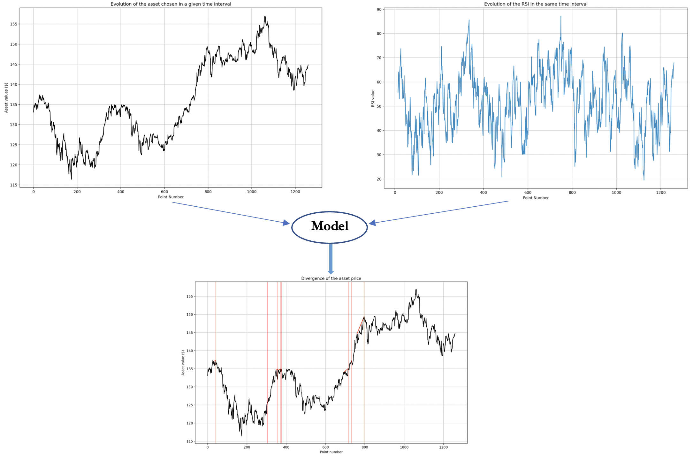
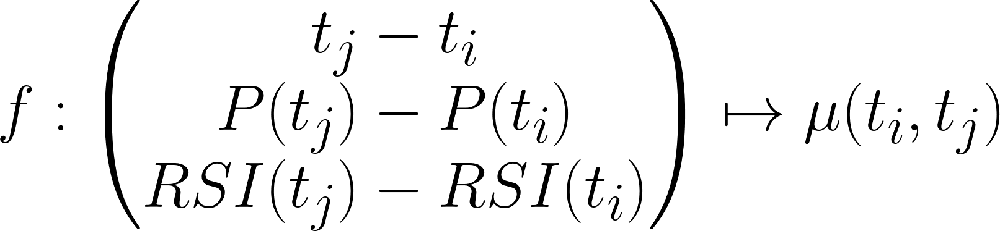
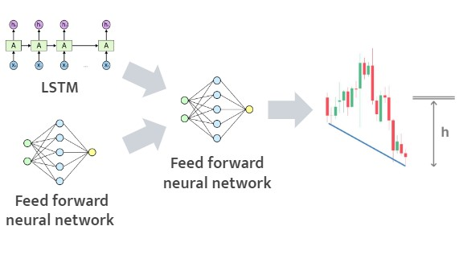

# Divergence detection in stock prices

Realized with Arthur Maron, this project is a continuation of the one initiated by [Victor Letzelter](https://github.com/Victorletzelter) and Hugo BESSON. It consists on the automatic detection of divergences, which occur between an asset and a momentum indicator. In the world of technical analysis, such project is relevant as such divergences indicate, with high probability, the direction in which the asset is likely to evolve. 

The present project allows to perform detection of the 4 types of divergences, which are the regular Bullish and Bearish divergences, and the hidden Bullish and Bearish divergences.

This detection occurs provided that the user provides the following inputs :

- The type of asset on which the detection is performed. 
- The time interval and time resolution associated with the test.
- The type of oscillator to be used (here, the RSI).
- The type of divergence to evaluate (among the four possible)

The result of the algorithm will be a list of two dimensionnals vectors, whose components correspond to the begginings and the ends of the divergences signals. 

The next Figure summarizes the process ;

*Inputs and outputs of the algorithm*

The second step of the algorithm, is to establish, for each divergence, a measure associated to the degree of confidence of it. To so do, a ML algorithm for predicting, given the characteristics of the divergence (length, asset price evolution, oscillator value evolution), a prediction of the *quality* of the divergence. 

*Function to bluid for measuring the quality of a divergence (denoted by \mu)*

A detailed and precise formulation of the problem, the principle and the results of this first part of the project are given in the notebook "src/Divergence_detection.ipynb".

## Deep learning method to evaluate the drop or climb height
Our main contribution to the work initiated by V.Letzelter and H.Besson is the adding of a deep learning model  to predict the 'quality' of the divergence and in order to estimate how much stock prices rise or fall as a result of the detected divergence. The predictors (input of the is neural network) gather both sequential data (list of the value of the stocks prices and the RSI from beginning t1 to the end tend of the divergence) and non-sequential data (slop of the stock market and the RSI, duration pf the divergence ...). To adress this challenge our network is composed of three parts:

1. The first one, composed LSTM layers for sequential input
2. The second one is a classical dense layers for 'non-sequential' inputs
3. The last part is also a dense layer that takes as input the ouput of the above sub-network.

The architecture of used neural network is shown here.

The neural network (NN) is used to predict the 'quality' of a divergence detected thanks to the algorithms developped in the fisrt part. This quality can be seen as the drop or the climb height after the detection of a divergence. As the result, it enables to predict how much and when we should invest ('take profit' in technical term) or withdraw a prior investment ('stop lost'). 

More details about the implementation and the results can be found in the jupyter notebook "algo_trading_training_NN.ipynb".

Note: Since I did not have enough space on GitHub to host the data for the training, one can use this [link](https://drive.google.com/file/d/1F01DyqZis9nXAAq4bOu8rbODMtTMDEln/view?usp=sharing) to dowloadd them. Although it is possible to generate them from the Russel3000 stock prices by using our code in the folder '/src' (In may take a lot of time to do the computation, we had to parallelize it !)

